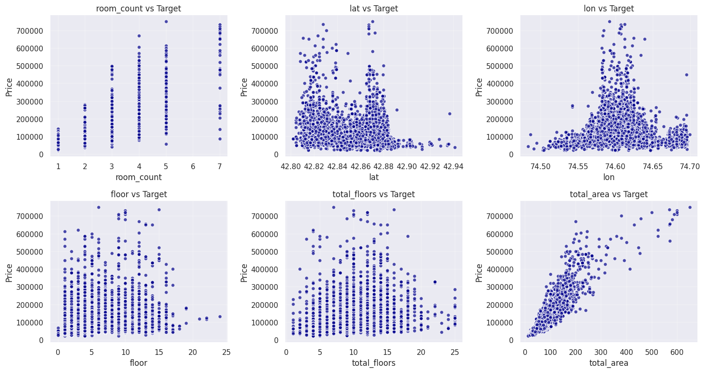

# Прогноз стоимости квартир в Бишкеке

## Описание проекта

Этот проект — интеллектуальная система для оценки стоимости недвижимости в Бишкеке с помощью ансамбля моделей машинного обучения.

Сервис предсказывает цену квартиры на основе её характеристик и координат, а также выводит 95% доверительные интервалы для более точной оценки.

Модели развернуты в виде веб-приложения на Hugging Face Spaces (Gradio) - https://huggingface.co/spaces/ErzhanAb/Bishkek_Real_Estate_Price_Prediction_Competition

## Как готовились данные

**Источник данных:** объявления о продаже квартир в Бишкеке (house.kg). Всего 7134 объектов.

### Очистка и обработка данных:

- Извлечение новых признаков из исходных данных, например: преобразование текстовых полей, расчет дополнительных категорий, кластеризация по координатам.
- Удаление строк с пропущенными значениями по ключевым признакам: площадь, количество комнат, этаж, координаты.
- Удаление большого количества признаков, в которых было слишком много пропусков или которые показывали слабую связь с таргетом (например, по низкой важности в feature importance или по корреляции).
- Удаление выбросов по цене (например, квартиры с площадью 50 м² по цене $500 000).
- Добавлен новый признак `hdbscan_cluster` — кластеризация локаций по алгоритму HDBSCAN (широта/долгота).
- Преобразование категориальных признаков через `OneHotEncoder`.
- Количество объектов уменьшено с 7134 до 7126 объектов.

### Удаление объектов с аномальными значениями:

- Использовалась предварительная модель `LinearRegression` для удаления квартир, где ошибка предсказания превышала ±20 000 USD для SGDRegressor.

## Обученные модели (3 модели)

### CatBoostRegressor 

- Основная модель: CatBoost с оптимизированными гиперпараметрами (Optuna).
- Доверительный интервал: отдельно обученные модели для квантилей 2.5% и 97.5%.
- Категориальные признаки используются напрямую, без OneHotEncoding.

### RandomForestRegressor

- RandomForest с гиперпараметрами, подобранными через Optuna.
- Доверительный интервал рассчитывается по всем деревьям ансамбля (бутстрэп по деревьям).

### SGDRegressor + Bagging

- Основной `SGDRegressor` в пайплайне с `OneHotEncoder` и `StandardScaler`.
- Отдельный `BaggingRegressor` на основе `SGDRegressor` для расчета доверительного интервала.
- Перед обучением были удалены объекты, где ошибка по `LinearRegression` превышала ±20 000 USD.

## Анализ моделей

- Все модели проходили 5-кратную кросс-валидацию.
- Оценивались метрики:

  - R²
  - MAE
  - MAPE

- Для `SGDRegressor` дополнительно анализировались коэффициенты признаков.
- Для `RandomForest` и `CatBoost` использовались `feature_importances_`.

## Гетероскедастичность

В данных наблюдается гетероскедастичность — дисперсия ошибки меняется в зависимости от площади, количества комнат и локации.

### Как это решается:

- Квантильная регрессия (CatBoost с квантилями).
- Бутстрэп по деревьям (RandomForest).
- Бутстрэп по моделям (SGD + Bagging).

## Структура проекта

- **app.py**
- **CatBoostRegressor_model.pkl**
- **CatBoost_lower.pkl**
- **CatBoost_upper.pkl**
- **RandomForestRegressor_model.pkl**
- **SGDRegressor_model.pkl**
- **SGD_BaggingInterval.pkl**
- **hdbscan_model.pkl**
- **category_options.pkl**
- **requirements.txt**
- **README.md**

## Как развернуть проект на Hugging Face Spaces

**Шаги для запуска:**

- Создайте Space с типом Gradio.
- Загрузите все файлы проекта, включая обученные модели (`.pkl` файлы).
- Создайте файл `requirements.txt` со следующим содержимым:

  - **gradio**
  - **catboost**
  - **scikit-learn==1.6.1**
  - **numpy**
  - **pandas**
  - **joblib**
  - **hdbscan**

- Запустите проект. Hugging Face автоматически выполнит `app.py`.

## HDBSCAN кластеризация

Для учета локации был добавлен признак `hdbscan_cluster`:

- Используется алгоритм кластеризации HDBSCAN по широте и долготе.
- Это позволяет автоматически выделить районы города на основе плотности данных, а не фиксированных границ.
- При вводе новых данных кластер определяется с помощью `hdbscan_model.pkl`.

## category_options.pkl

Файл `category_options.pkl` содержит словарь со всеми уникальными значениями категориальных признаков:

- **"Серия"** — тип серии дома.
- **"house_material"** — материал стен.
- **"Отопление"** — тип отопления.
- **"Состояние"** — состояние квартиры.

Этот файл используется для создания удобных Dropdown-меню в интерфейсе Gradio.

## Использование HDBSCAN и категорий в инференсе

При вводе новых данных пользователем:

- Определяется кластер с помощью `hdbscan_model.pkl`.
- Категориальные признаки выбираются из `category_options.pkl` для корректного `OneHotEncoding` и валидации ввода.

# Входные признаки модели

На вход всех моделей подаются следующие признаки:

| Признак           | Описание                                                                        |
|-------------------|---------------------------------------------------------------------------------|
| `room_count`      | Количество комнат                                                               |
| `lat`             | Широта (latitude) — географическая координата                                   |
| `lon`             | Долгота (longitude) — географическая координата                                 |
| `Серия`           | Серия дома (например, "104", "хрущевка")                           |
| `house_material`  | Материал стен (например, "кирпичный", "панельный", "монолитный")                 |
| `floor`           | Этаж квартиры                                                                   |
| `total_floors`    | Общее количество этажей в доме                                                  |
| `total_area`      | Общая площадь квартиры (в квадратных метрах)                                    |
| `Отопление`       | Тип отопления (например, "центральное")                               |
| `Состояние`       | Состояние квартиры (например, "евроремонт")                  |
| `hdbscan_cluster` | Кластер, определенный алгоритмом HDBSCAN на основе координат (lat, lon)         |

## Как определяется кластер?

Кластеризация по координатам позволяет учитывать особенности районов (центральные, спальные, окраины).

*   Кластеры формируются автоматически с помощью HDBSCAN на основе `lat` и `lon`.
*   При вводе новых данных кластер назначается через предобученную модель `hdbscan_model.pkl`.
